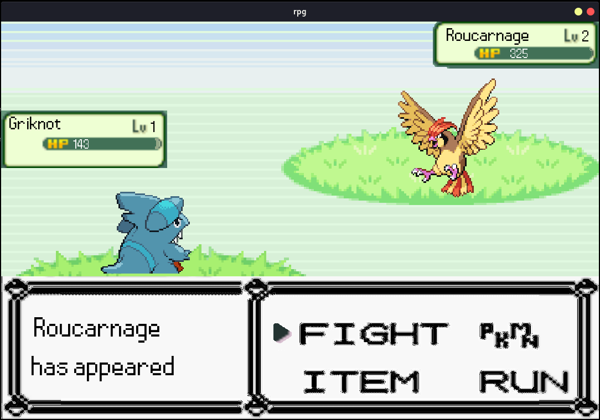
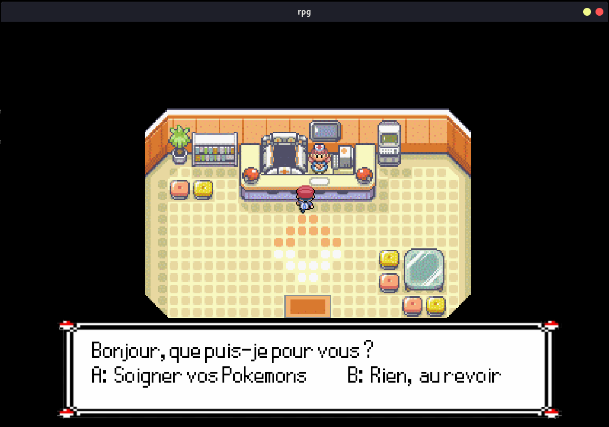
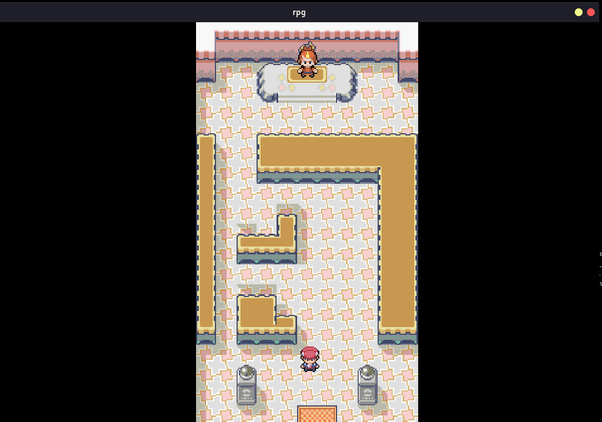
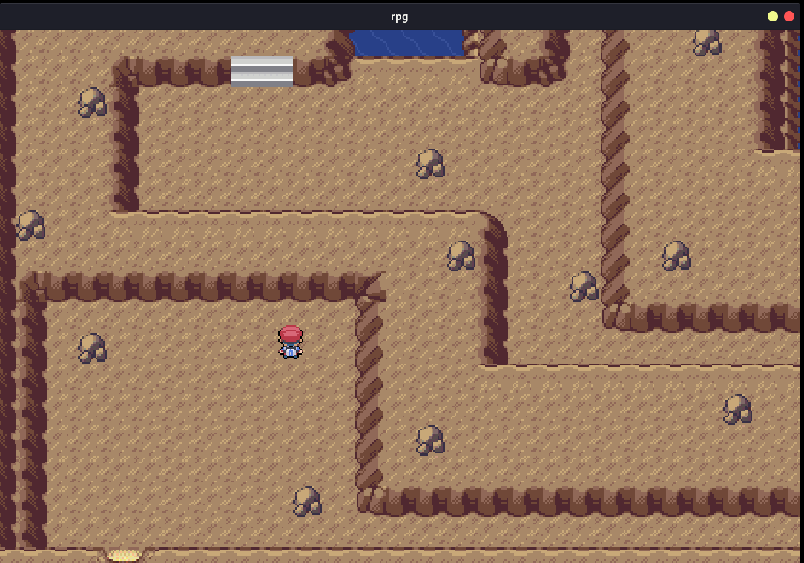

# My_rpg

## Introduction

My_rpg Epitech project done by [henry334](https://github.com/henry334) [gredzy](https://github.com/gredzy) [ugeaux](https://github.com/ugeaux) and [bendsp](https://github.com/bendsp)

Dont forget to star the project if you like it! :star:

## Table of Contents

- [Installation](#installation)
- [Usage](#usage)
- [Featurs](#Featurs)
- [Preview](#Preview)

## Installation

- Install [CSFML-2.5.1](https://www.sfml-dev.org/download/csfml/index-fr.php)
- Git clone (green button)
- Compile: cd ./My_rpg_Pokemon-Epitech; make; ./my_rpg

## Usage

./my_rpg -h will display help

## Featurs

- Inventory
- 1 Quests
- Menu to manage your pokemons
- Load/Save up to 11 games
- 5 Pokemons with there own stats/attacks and amelioration
- 5 Buildings (Shop, Pharmacy, Arena, Boss, Home)
- 2 type of area (Map, Tunnel)
- 3 type of Png (Trainer, Wild, Boss)
- ...

## Preview

### Menu
---------------
- Main menu

     
  
   
   

### Pokemons
---------------

- Fantominus

     
  
   
   

- Roucarnage

     
  
   
   

### Buildings
---------------

- Home

     
  
   
   

- Shop

     
  
   
   

- Pharmacy

     
  
   
   

- Arena

     
  
   
   

### Png
---------------

     
  
   
   

### Tunnel / Map
---------------

- Main map

     
  
   
   

- Tunnel

     
  
   
   

